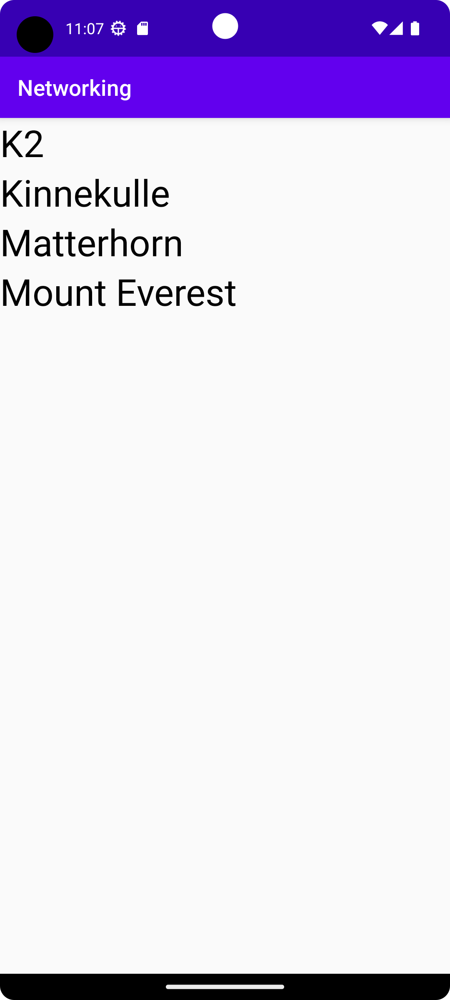

# Rapport

Added the recycle view to the main activity xlm. Specified the layout here instead of java file.

> app:layoutManager="androidx.recyclerview.widget.LinearLayoutManager"

Created a new layout for the recycle view items and the Mountain class which will hold the data 
for each item.  

Created an adapter that will take a list of mountains. It holds a ViewHolder and sets the text
of recycle view items to the name of each mountain.

>  holder.text.setText(mountains.get(position).getName());

Set gson as dependency and set permissions to access internet.

Updated and used the JSON_URL with the JsonTask. Wrote code in the onPostExecute method to use the 
json, add it to a list and pass it on to the adapter. 

